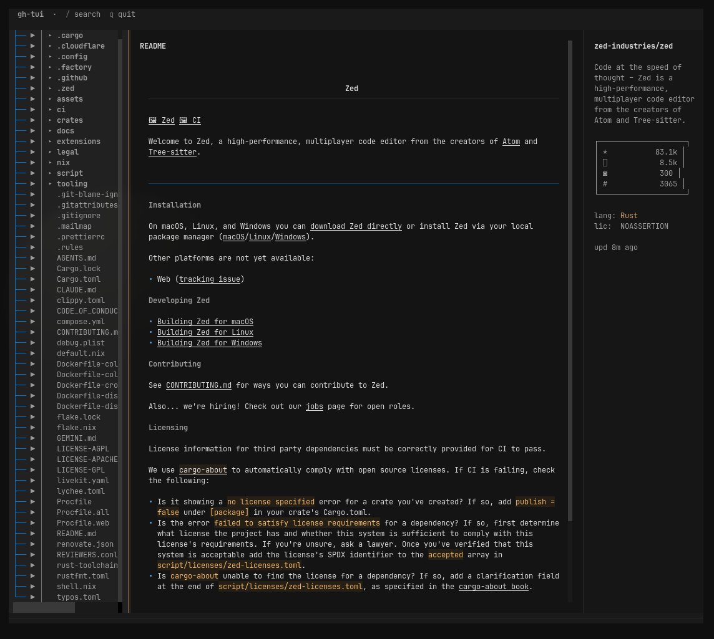

# gh-tui

A keyboard-driven GitHub **repository browser** for the terminal. Browse file trees, read READMEs with rich markdown, and view source files with syntax highlighting — without opening a browser.

Built with [Textual](https://textual.textualize.io/) and the GitHub REST API.


## Screenshot



*Search results for `zed-ide/zed` — file tree, README markdown, and stats panel.*

## Features (Phase 1)

- Search public (and private) repositories
- File tree navigation with folder expansion
- README rendered as markdown
- Syntax-highlighted code viewer
- Repo stats panel (stars, forks, language, license)
- SQLite cache (10-minute TTL) to reduce API usage
- Works without a token in public-only mode

## Install

```bash
git clone <repo-url>
cd gh-tui
pip install -e .
```

Requires **Python 3.10+**.

## Authentication

On first run, gh-tui prompts for a GitHub **classic Personal Access Token**. You can skip this to use public-only mode (60 API requests/hour).

To set a token manually, create `~/.config/gh-tui/config.toml`:

```toml
[github]
token = "ghp_your_token_here"

[cache]
ttl_seconds = 600
```

Or export `GITHUB_TOKEN` / `GH_TOKEN` in your environment.

**Scopes needed:** `repo` (for private repos), or no scopes for public-only browsing.

## Usage

```bash
# Open search overlay
gh-tui

# Open a specific repo directly
gh-tui facebook/react
```

### Keybindings

| Key | Action |
|-----|--------|
| `/` | Search repositories |
| `↑/↓` or `j/k` | Navigate file tree |
| `Enter` | Open file or expand folder |
| `Esc` or `h` | Back to README |
| `Tab` | Cycle focus between panels |
| `b` | Open current page in browser |
| `r` | Refresh (bypass cache) |
| `q` | Quit |

## Limitations

- Read-only — no git operations, issues, or PRs (planned for later phases)
- Markdown edge cases (HTML, Mermaid, wide tables) may render poorly — press `b` to open in browser
- Classic PAT only for MVP (no Enterprise GitHub yet)

## License

MIT — see [LICENSE](LICENSE).
